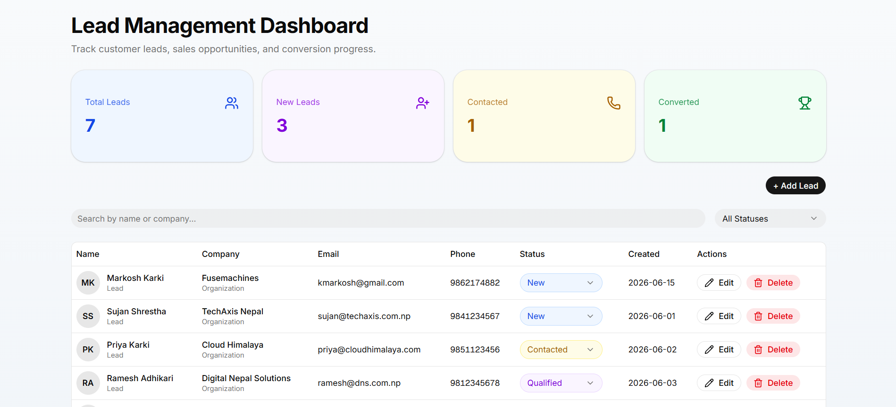
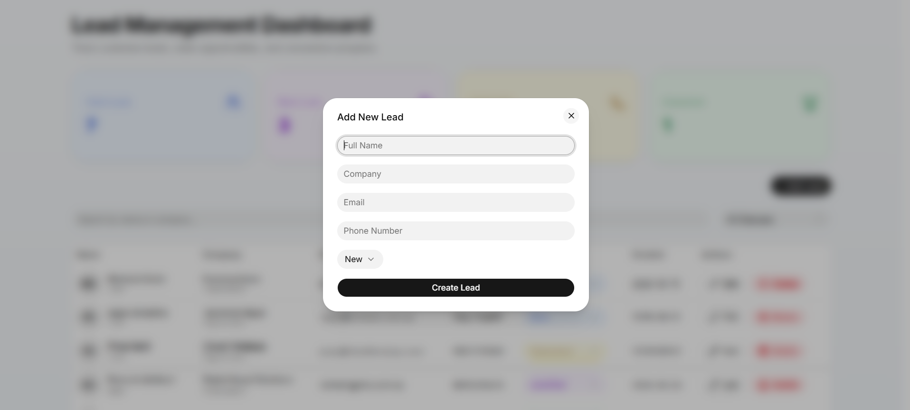
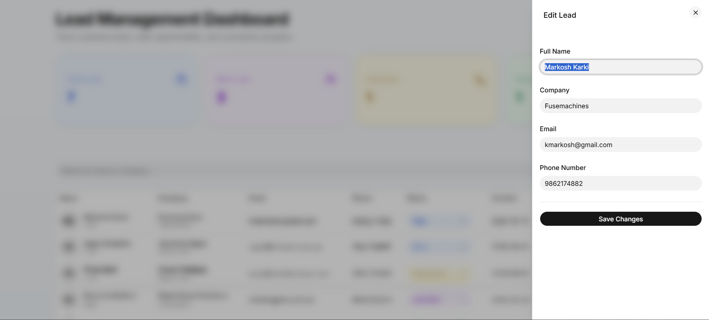

# Lead Management Dashboard

A modern CRM-style Lead Management Dashboard built with Next.js 16, TypeScript, Tailwind CSS, and shadcn/ui.

## Features

- Create Leads
- Edit Lead Information
- Delete Leads
- Status Tracking
- Search Leads
- Filter Leads by Status
- Pagination
- Dashboard Analytics
- Local Storage Persistence
- Responsive Design
- Toast Notifications
- Confirmation Dialogs

## Screenshots

### Dashboard



### Add Lead



### Edit Lead



## Tech Stack

- Next.js 16.2.9
- React 19
- TypeScript
- Tailwind CSS
- shadcn/ui
- Lucide React
- Sonner

## Installation

```bash
git clone <repository-url>
cd lead-management-dashboard
npm install
npm run dev
```

## Project Structure

```txt
src/
├── app/
├── components/
├── data/
├── lib/
└── types/
```

## Key Features Implemented

### Lead Management

- Create new leads
- Edit lead information
- Delete leads with confirmation
- Track lead status

### Dashboard Analytics

- Total Leads
- New Leads
- Contacted Leads
- Converted Leads

### User Experience

- Search functionality
- Status filtering
- Pagination
- Responsive design
- Toast notifications
- Persistent data storage

## Future Improvements

- Authentication
- Backend Integration
- Database Support
- CSV Export
- Role-Based Access Control
- Email Notifications

## Author

Markosh Karki
